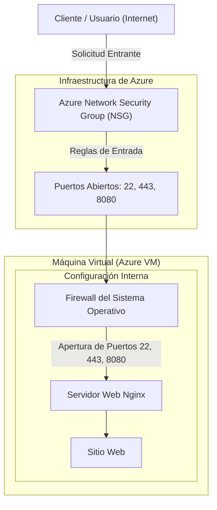

# Arquitectura Básica en Azure con Servidor Web Nginx

Esta documentación describe la arquitectura de infraestructura para alojar y ejecutar un sitio web en Microsoft Azure de manera segura.

## Descripción de la Arquitectura

### Componentes Principales

1. **Máquina Virtual (Azure VM)**  
   Instancia de servidor en la nube de Azure que funciona como el entorno de ejecución para el sitio web.

2. **Servidor Web Nginx**  
   Servidor web instalado dentro de la VM, configurado para procesar las peticiones entrantes y ejecutar/servir el sitio web.

3. **Reglas de Entrada en Azure (Network Security Group - NSG)**  
   Capa de seguridad a nivel de red en la infraestructura de Azure donde se configuran las reglas de seguridad de entrada (*Inbound Security Rules*) para filtrar el tráfico externo y habilitar los siguientes puertos:
   - **Puerto 22**: Acceso para administración y conexión remota por SSH.
   - **Puerto 443**: Tráfico web seguro mediante cifrado HTTPS.
   - **Puerto 8080**: Acceso al servicio web o aplicación alojada en este puerto.

4. **Firewall del Sistema Operativo en la VM**  
   Configuración del firewall interno del sistema operativo de la máquina virtual (por ejemplo, UFW en Linux o Windows Firewall) donde se abren explícitamente los puertos **22**, **443** y **8080**. Esto asegura que las conexiones permitidas por Azure atraviesen el filtro interno de la VM y lleguen al servidor Nginx.

### Flujo de Tráfico

Las solicitudes entrantes desde Internet pasan primero por las **reglas de entrada de Azure (NSG)**. Una vez validadas, cruzan el **firewall interno de la VM** en los puertos autorizados (22, 443, 8080) hasta llegar al **servidor Nginx**, que procesa la petición y entrega el sitio web al usuario.

---

## Gráfico de Arquitectura

